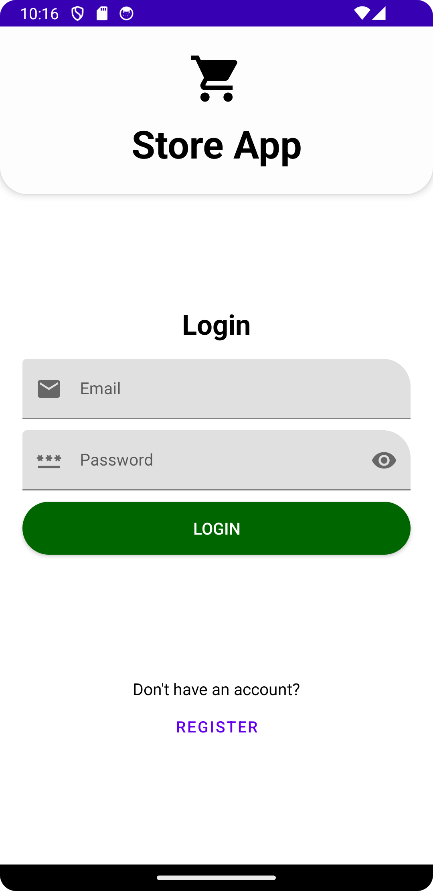
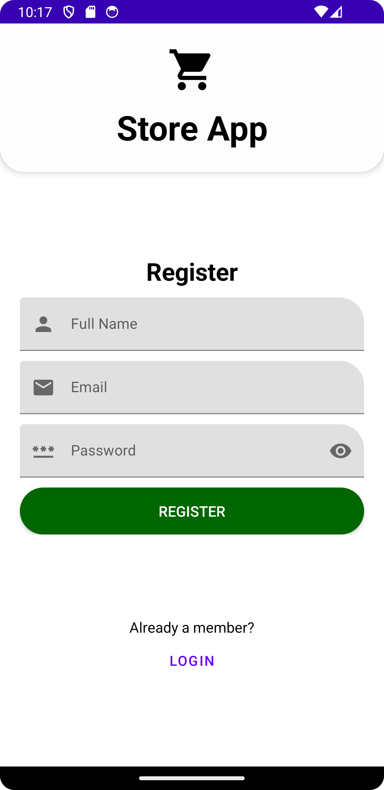
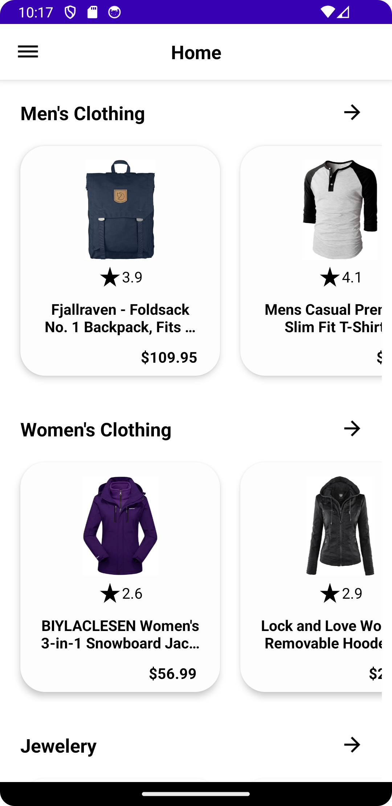
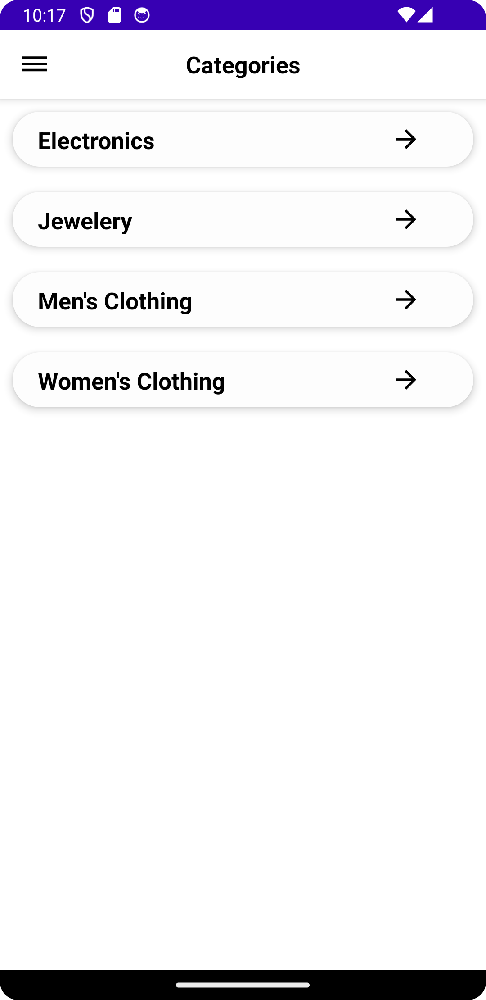
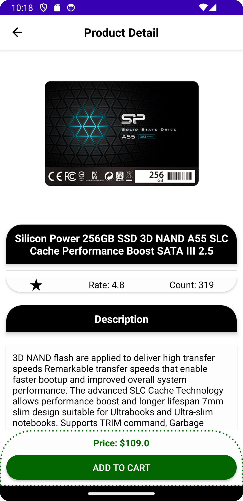
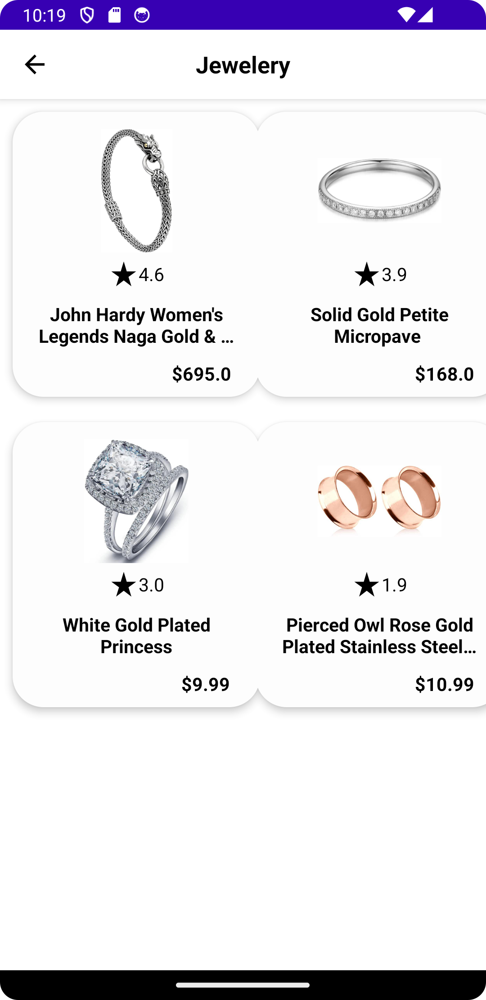
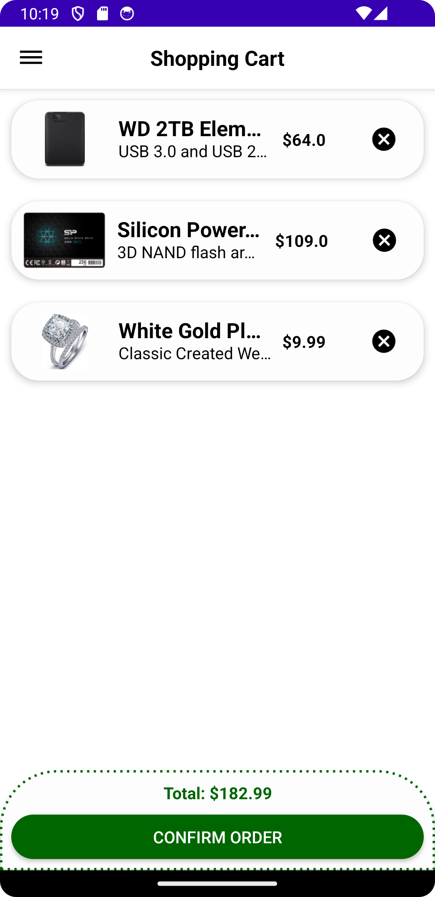
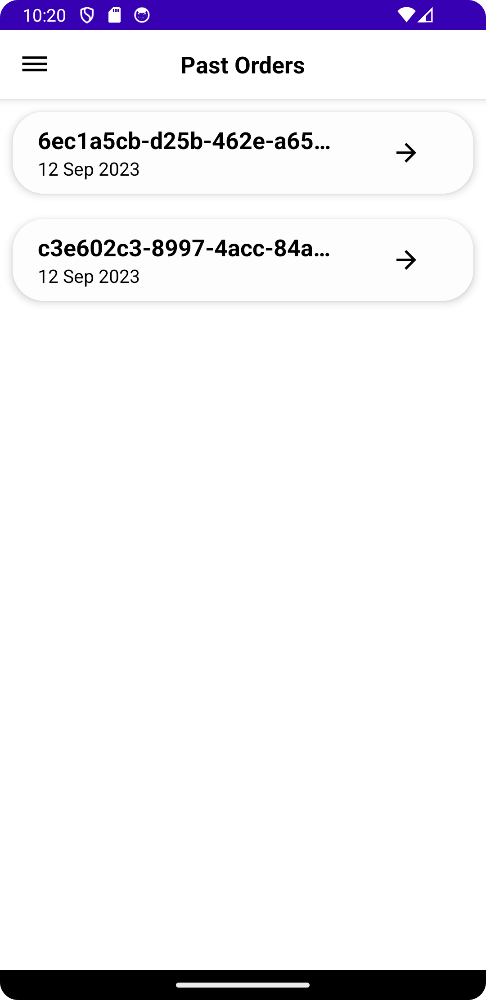
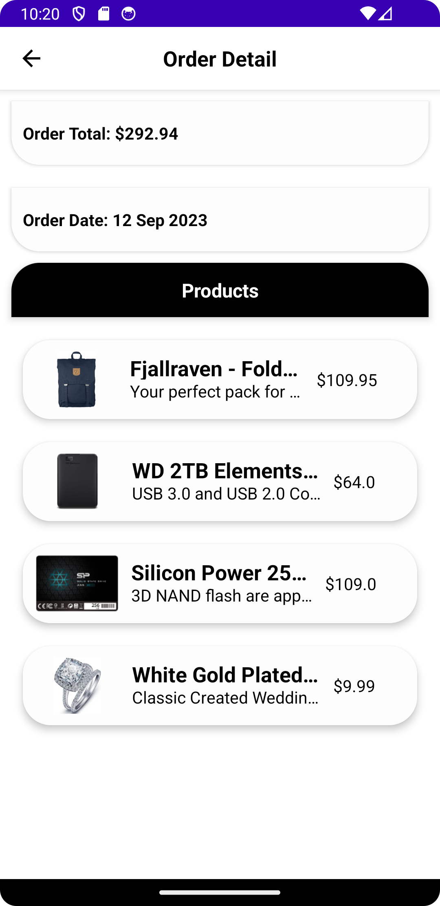

# Android-Store-App-Java
Java (MVVM) Android mağaza uygulaması.

---
## Özellikler
* Üyelik oluşturma
* Alışveriş sepetine ürün ekleme
* Sipariş verme
* Geçmiş siparişleri görüntüleme

---

## API
- [Fake Store Api](https://github.com/keikaavousi/fake-store-api)

---

## Uygulama Videosu

https://github.com/samet-ozkan/Android-Store-App-Java/assets/55306181/6d30b0cc-1752-4ccc-ac21-3526bcd6031f

---
## Kullanılan Teknolojiler
* Retrofit
* Dagger2
* RxJava
* Glide
* Firebase Authentication
* Firestore Database
* ViewModel
* DataBinding
* SharedPreferences

---
## Ekran Görüntüleri
<table>
  <tr>
    <td align="center"></td>
    <td align="center"></td>
    <td align="center"></td>
  </tr>
  <tr>
    <td align="center"></td>
    <td align="center"></td>
    <td align="center"></td>
  </tr>
   <tr>
    <td align="center"></td>
    <td align="center"></td>
    <td align="center"></td>
  </tr>
</table>

---
## İletişim

Email: <a href="mailto:samet-ozkan@outlook.com">samet-ozkan@outlook.com</a>

